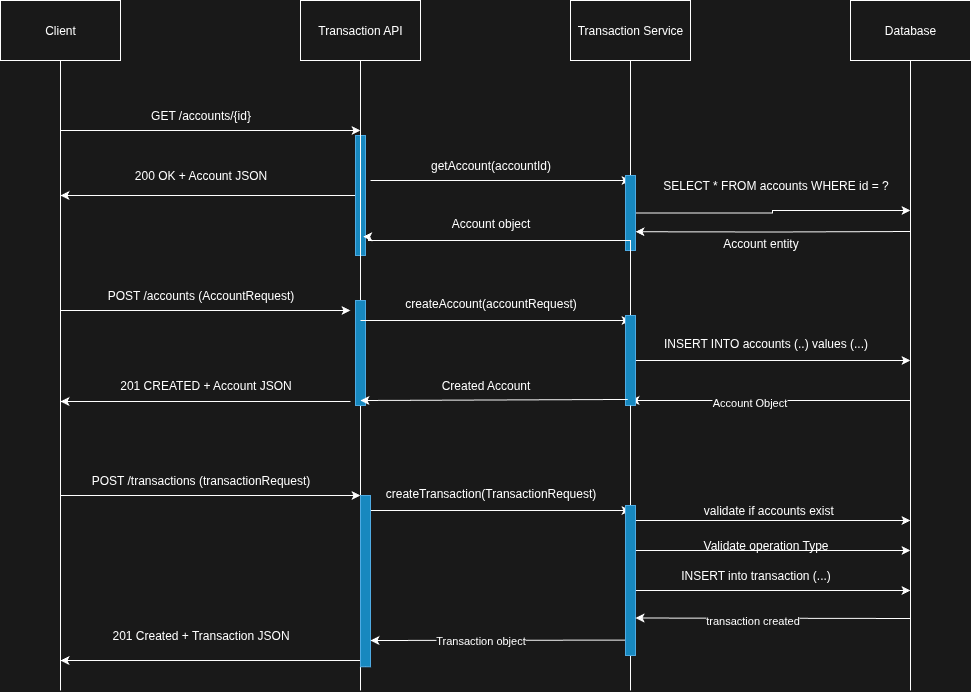

# Transaction Challenge
## Requirements

### Transactions routine

Each cardholder (customer) has an account with their data.

For each operation done by the customer a transaction is created and associated with their respective account.

Each transaction has a specific type (normal purchase, withdrawal, credit voucher or purchase with installments)

Transactions of type purchase and withdrawal are registered with negative amounts, while transactions of credit voucher are registered with positive value.

#### Data structure

The following diagram shows a suggested structure for this test. (Feel free to create your own model!)

#### Accounts
| Account_ID | Document_Number |
|------------|-----------------|
| 1          | 12345678900     |

#### OperationsTypes
| OperationType_ID | Description            |
|------------------|------------------------|
| 1                | Normal Purchase        |
| 2                | Purchase with installments |
| 3                | Withdrawal             |
| 4                | Credit Voucher         |

#### Transactions
| Transaction_ID | Account_ID | OperationType_ID | Amount | EventDate                   |
|----------------|------------|------------------|--------|----------------------------|
| 1              | 1          | 1                | -50.0  | 2020-01-01T10:32:07.7199222 |
| 2              | 1          | 1                | -23.5  | 2020-01-01T10:48:12.2135875 |
| 3              | 1          | 1                | -18.7  | 2020-01-02T19:01:23.1458543 |
| 4              | 1          | 4                | 60.0   | 2020-01-05T09:34:18.5893223 |

In table Transactions, the column Amount holds the value of the transaction and the column EventDate holds the moment that the transaction occurred.

### Endpoints

Create the endpoints below according to the use cases previously mentioned.

#### POST /accounts (create an account)
Request Body:
```json
{
  "document_number": "12345678900"
}
```

#### GET /accounts/:accountId (retrieve the account information)
Response Body:
```json
{
  "account_id": 1,
  "document_number": "12345678900"
}
```

#### POST /transactions (create a transaction)
Request Body:
```json
{
  "account_id": 1,
  "operation_type_id": 4,
  "amount": 123.45
}
```

## Documentation
### How to run

This project uses `Makefile` to run the project, or if your machine doesnt have. In the same directory is the `gradlew`:

```shell
make run
# or
./gradlew bootRun
```

### How to test

```shell
make test # to run all tests
```

### How to interact

Some examples of interaction with the API using cUrl:
```shell


## Creating an account

curl -X POST --location "http://localhost:8080/accounts" \
    -H "Content-Type: application/json" \
    -d '{
          "documentNumber": "39293399865"
        }'
    
     
### Getting an account

 curl -X GET --location "http://localhost:8080/accounts/16"


### Creating a valid transaction
 
 curl -X POST --location "http://localhost:8080/transaction" \
     -H "Content-Type: application/json" \
     -d '{
           "accountId": 16,
           "operationTypeId": 2,
           "amount": 100.00
         }'

```

### Implementation Details

- Implemented with Spring Boot (which facilitates the conversion between types, persistence configuration, testing, docker-compose and other things).
- This project uses `spring docker compose` support.

### Sequence diagram

- 


### Schema / DDL / DML

You can see in the schema.sql file in the `src/main/resources/schema.sql` or below:

```sql
DROP TABLE IF EXISTS account CASCADE ;
DROP TABLE IF EXISTS transaction CASCADE ;

CREATE TABLE IF NOT EXISTS account
(
    account_id              BIGINT GENERATED BY DEFAULT AS IDENTITY NOT NULL,
    document_number VARCHAR(255),
    CONSTRAINT pk_account PRIMARY KEY (account_id)
);

CREATE TABLE IF NOT EXISTS transaction
(
    transaction_id    BIGINT GENERATED BY DEFAULT AS IDENTITY NOT NULL,
    account_id        BIGINT,
    operation_type_id SMALLINT,
    amount            DOUBLE PRECISION                        NOT NULL,
    transaction_date  TIMESTAMP WITHOUT TIME ZONE,
    CONSTRAINT pk_transaction PRIMARY KEY (transaction_id)
);

ALTER TABLE transaction
    ADD CONSTRAINT FK_TRANSACTION_ON_ACCOUNT FOREIGN KEY (account_id) REFERENCES account (account_id);
```


## Evolution

Every project I work on, I try to think about the future and the path ahead. So, looking at this project, I believe the next features could be:

- **GET endpoint** for all transactions with pagination
- **Account balance retrieval** for the user
- **Concurrency control** (pessimistic/optimistic locking) for operations like withdraw/deposit
- **Queues and events** for better decoupling and additional features (notifications, logging, reports)
- **State machine + idempotency**